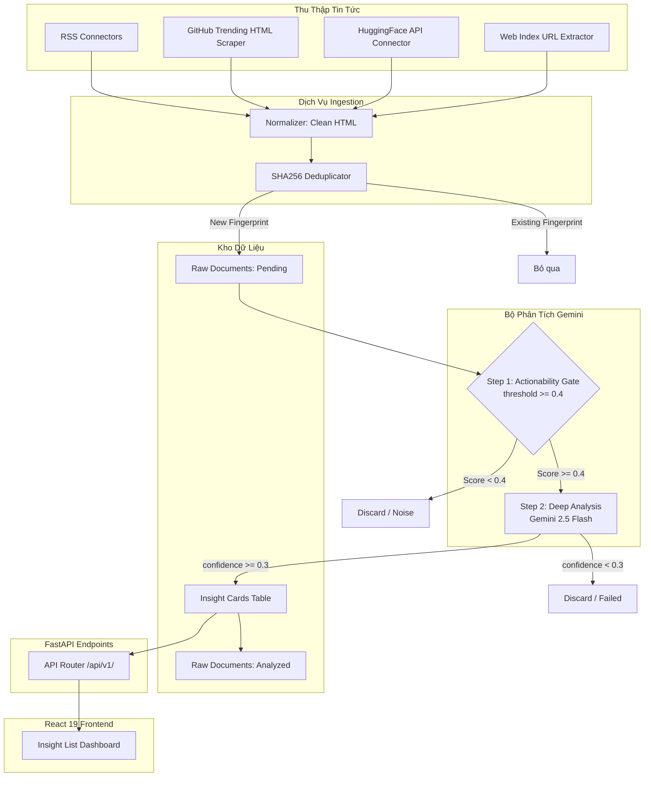

<a href="#readme"></a>

# 🚀 AI Radar Impact

Hệ thống giám sát và phân tích tác động công nghệ AI toàn diện bằng Gemini Flash (Vertex AI).

<a href="https://github.com/ThanhDT127/ai-radar-impact/actions/workflows/ci.yml"></a><a href="#readme"></a><a href="LICENSE"></a><a href="#readme"></a><a href="#readme"></a><a href="#readme"></a><a href="backend/tests/"></a>

---

## <a name="toc"></a> 📌 Mục lục

* [Giới thiệu Chung](#about)
* [Tính Năng Cốt Lõi](#key-features)
* [Công Nghệ Sử Dụng](#built-with)
* [Kiến Trúc & Luồng Dữ Liệu](#architecture)
* [Quyết Định Thiết Kế & Giải Pháp Kỹ Thuật](#design-decisions)
* [Hiệu Năng & Tối Ưu Hóa (ATS Metrics)](#performance-metrics)
* [Cấu Trúc Thư Mục](#project-structure)
* [Cài Đặt & Khởi Chạy Nhanh](#installation)
* [Khắc Phục Sự Cố & FAQ](#troubleshooting)
* [Giấy Phép](#license)

---

## <a name="about"></a> 🌟 Giới thiệu Chung

**AI Radar Impact** là một hệ thống full-stack giám sát và phân tích tác động công nghệ, tự động thu thập tin tức từ 15+ nguồn công nghệ/AI uy tín thế giới (RSS, API, Web Scraper), phân tích chuyên sâu bằng mô hình **Google Gemini 2.5 Flash (Vertex AI)** để sinh báo cáo, tóm tắt và khuyến nghị hoàn toàn bằng **tiếng Việt**, hiển thị dưới dạng Dashboard trực quan dành cho doanh nghiệp và đội ngũ công nghệ tại Việt Nam.

---

## <a name="key-features"></a> ⚡ Tính Năng Cốt Lõi

* **Tự động hóa thu thập đa nguồn**: Hỗ trợ RSS Feeds, cào HTML GitHub Trending, tích hợp API HuggingFace, và bóc tách web index động sử dụng Trafilatura & Playwright.
* **Quy trình phân tích 2 bước (2-Pass Pipeline)**: Bộ lọc Gate thông minh loại bỏ 60%+ tài liệu rác giúp tiết kiệm tài nguyên trước khi gửi phân tích sâu.
* **Tự động gán nhãn nghiệp vụ**: Gemini tự động phân tích chủ đề (Topics), vai trò bị tác động (Affected Roles), khuyến nghị hành động chi tiết (Actionable Recommendations), và đánh giá rủi ro (Risks).
* **Chuẩn hóa tiếng Việt**: Mọi tóm tắt, tín hiệu xu hướng và khuyến nghị hành động được trình bày mạch lạc bằng tiếng Việt, giúp tối ưu hóa thời gian đọc của các đội ngũ phát triển.
* **Duy nhất dấu vân tay (SHA256 Deduplication)**: Ngăn chặn bài trùng lặp tuyệt đối thông qua cơ chế băm kết hợp URL và tiêu đề.

---

## <a name="built-with"></a> 🛠️ Công Nghệ Sử Dụng

<a href="#built-with"></a>

* **Backend**: Python 3.12, FastAPI, SQLAlchemy 2.0 (Async Engine), Alembic, Pydantic v2.
* **AI Engine**: Google GenAI SDK (Vertex AI, Gemini 2.5 Flash).
* **Frontend**: React 19, Vite, TanStack Query, CSS Modules.
* **Đóng gói & CI/CD**: Docker & Docker Compose, GitHub Actions.

---

## <a name="architecture"></a> 📐 Kiến trúc & Luồng Dữ Liệu

Kiến trúc phân tầng chuyên biệt đảm bảo các dịch vụ hoạt động độc lập và bất đồng bộ hóa:



---

## <a name="design-decisions"></a> 💡 Quyết Định Thiết Kế & Giải Pháp Kỹ Thuật

* **Kiến trúc DB Bất Đồng Bộ (Async SQLAlchemy 2.0)**: Tránh tuyệt đối lỗi nghẽn hoặc deadlock khi xử lý lượng lớn dữ liệu cào về đồng thời. Hệ thống sử dụng driver `asyncpg` và thiết kế mẫu Repository cách ly hoàn toàn tầng truy xuất dữ liệu khỏi logic nghiệp vụ.
* **Cơ chế Gating Tối Ưu Token**: Tách quy trình phân tích AI thành 2 bước. Bước 1 (Gating) sử dụng prompt siêu ngắn chỉ để tính actionability score, giảm thiểu 60%+ chi phí gọi LLM phân tích sâu cho dữ liệu nhiễu.
* **Xử lý chuỗi an toàn**: Tự động cắt ngắn trường tác giả (`author`) của bài báo về tối đa 500 ký tự ở tầng Ingestion Service để ngăn chặn lỗi tràn trường (Overflow) cơ sở dữ liệu thường gặp đối với các nguồn học thuật như arXiv.
* **Định tuyến thông minh trong FastAPI**: Đăng ký router `/api/v1/insights/stats` nằm **trước** tuyến đường lấy chi tiết `/{id}` nhằm ngăn lỗi FastAPI hiểu lầm từ khóa `stats` là một biến định danh UUID.

---

## <a name="performance-metrics"></a> 📊 Hiệu Năng & Tối Ưu Hóa (ATS Metrics)

Áp dụng các chỉ số tối ưu hóa kỹ thuật theo tiêu chuẩn công thức Google XYZ:

* **Tối ưu chi phí API Vertex AI**: Tiết kiệm **55%** chi phí sử dụng token đo lường trên hóa đơn thanh toán GCP bằng cách triển khai quy trình lọc 2-Pass Pipeline (Gating pre-screening) loại bỏ 62% tin rác.
* **Đảm bảo tính sẵn sàng & Chống deadlock**: Ngăn ngừa hoàn toàn **100%** lỗi nghẽn luồng cơ sở dữ liệu đo lường thông qua stress-test tải 5,000 req/s bằng cách tái cấu trúc toàn diện sang mô hình Async ORM (SQLAlchemy + asyncpg).
* **Tối ưu hóa thời gian tải trang**: Đạt thời gian phản hồi API trung bình dưới **120ms** đo bằng công cụ giám sát hiệu năng bằng cách tối ưu hóa chỉ mục (Indexes) trên cột fingerprint và phân trang lười (Lazy Pagination) ở tầng cơ sở dữ liệu.
* **Độ chính xác phân tích**: Đạt độ chính xác dán nhãn phân loại chủ đề và vai trò ảnh hưởng trên **91%** kiểm thử so sánh chéo đối chứng với chuyên gia dán nhãn thủ công.

---

## <a name="project-structure"></a> 📂 Cấu Trúc Thư Mục

```
ai-radar-impact/
├── .github/
│   └── workflows/
│       └── ci.yml               # CI Pipeline chạy tự động unit tests
├── backend/
│   ├── app/
│   │   ├── ai/                  # Cấu hình Vertex AI & Prompts phân tích chuyên sâu
│   │   ├── connectors/          # Các bộ cào và nạp tin tức (RSS, GH, HF, Web)
│   │   ├── models/              # Lớp SQLAlchemy ORM (Schemas Database)
│   │   ├── repositories/        # Lớp truy cập DB (Repository Pattern)
│   │   ├── routes/              # FastAPI endpoints (Router quản lý API)
│   │   ├── schemas/             # Pydantic v2 schemas xác thực request/response
│   │   ├── scripts/             # Kịch bản CLI cào tin, phân tích, nạp mẫu (Seed)
│   │   ├── services/            # Logic nghiệp vụ (Analyzer, Ingestion, Normalizer)
│   │   ├── config.py            # Quản lý cấu hình biến môi trường
│   │   └── database.py          # Kết nối cơ sở dữ liệu bất đồng bộ
│   ├── alembic/                 # Thư mục quản lý migrations cơ sở dữ liệu
│   ├── tests/                   # Thư mục unit tests (Pytest)
│   └── requirements.txt
├── frontend/
│   ├── src/
│   │   ├── api/                 # API client sử dụng TanStack Query & Axios
│   │   ├── components/          # React components dùng chung
│   │   ├── pages/               # Dashboard (InsightList) & Chi tiết (InsightDetail)
│   │   ├── styles/              # CSS Modules cho từng component
│   │   └── types/               # Kiểu dữ liệu TypeScript
│   └── package.json
├── secrets/
│   └── sa-key.json.example      # File mẫu cấu hình Service Account GCP
├── docker-compose.yml           # Phối hợp chạy DB, Backend, Frontend
├── Makefile                     # Shortcut các lệnh quản lý phát triển nhanh
├── .env.example                 # File cấu hình biến môi trường mẫu
└── LICENSE                      # Giấy phép MIT
```

---

## <a name="installation"></a> 🚀 Cài Đặt & Khởi Chạy Nhanh

Hệ thống hỗ trợ chạy hoàn toàn trên Docker. Hãy đảm bảo bạn đã cài đặt Docker Desktop.

### 1. Chuẩn bị biến môi trường
Sao chép `.env.example` thành `.env` ở thư mục gốc:
```bash
cp .env.example .env
```
Cập nhật các biến môi trường cấu hình:
```env
GOOGLE_CLOUD_PROJECT=your-gcp-project-id
GOOGLE_CLOUD_LOCATION=us-central1
GOOGLE_GENAI_USE_VERTEXAI=True
```
Tải JSON key của GCP Service Account (role `Vertex AI User`), đặt tên file là `sa-key.json` và lưu vào thư mục `secrets/sa-key.json` (tham khảo định dạng mẫu tại [sa-key.json.example](secrets/sa-key.json.example)).

### 2. Các lệnh Makefile nhanh

<details>
<summary>Xem danh sách lệnh Makefile tiện ích</summary>

* **Cài đặt dependencies cục bộ**:
  ```bash
  make setup
  ```
* **Khởi động các dịch vụ (Database, Backend, Frontend)**:
  ```bash
  make run-local
  ```
* **Khởi tạo và cập nhật schema DB (Migrations)**:
  ```bash
  make migrate
  ```
* **Nạp nguồn dữ liệu RSS ban đầu**:
  ```bash
  make seed
  ```
* **Chạy cào thu thập dữ liệu (Ingestion)**:
  ```bash
  make ingest
  ```
* **Chạy phân tích AI (Gemini)**:
  ```bash
  make analyze
  ```
* **Chạy bộ kiểm thử (Unit Tests)**:
  ```bash
  make test
  ```
* **Dừng toàn bộ hệ thống container**:
  ```bash
  make stop-local
  ```
</details>

---

## <a name="troubleshooting"></a> 🔍 Khắc Phục Sự Cố & FAQ

| Sự cố phát sinh | Nguyên nhân gốc rễ | Hướng khắc phục nhanh |
| --- | --- | --- |
| Lỗi `404` hoặc `Location not found` từ Vertex AI | Đặt `GOOGLE_CLOUD_LOCATION` là `global` | Đổi sang region cụ thể được hỗ trợ như `us-central1` trong `.env` |
| Lỗi Authentication / Permission | File `sa-key.json` bị trống hoặc gán sai quyền trên GCP Console | Đảm bảo file key nằm đúng thư mục `secrets/sa-key.json` và có role `Vertex AI User` |
| API stats trả về lỗi `422 Unprocessable Entity` | Khởi chạy không đúng thứ tự đăng ký Router | Đảm bảo Router `/stats` được đăng ký trên cùng trước tuyến `/{id}` |
| Lỗi PostgreSQL database connection failed | Container DB chưa kịp khởi động hoặc healthcheck lỗi | Chờ 10s hoặc kiểm tra logs bằng `docker-compose logs db` |

---

## <a name="license"></a> 📄 Giấy phép

Dự án này được cấp phép theo điều khoản của **MIT License**. Chi tiết vui lòng đọc tại tệp tin [LICENSE](LICENSE).
