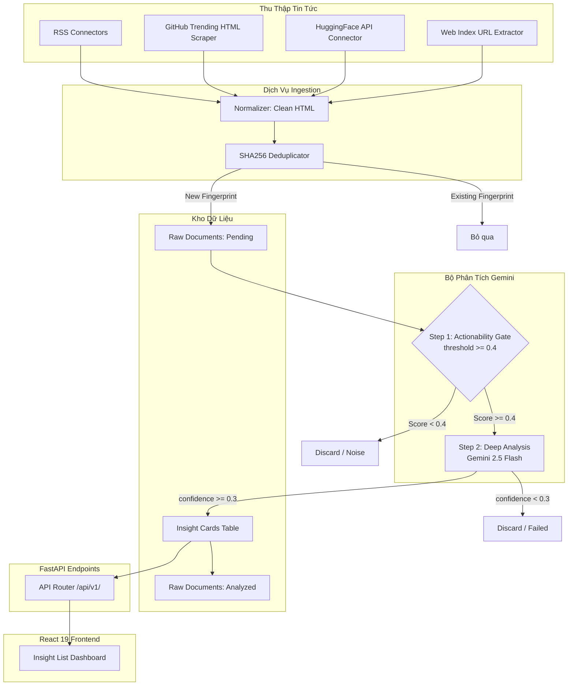

<a href="#readme"></a>

# 🚀 AI Radar Impact

Hệ thống giám sát và phân tích tác động công nghệ AI toàn diện bằng Gemini Flash (Vertex AI).

<a href="https://github.com/ThanhDT127/ai-radar-impact/actions/workflows/ci.yml"></a><a href="#readme"></a><a href="LICENSE"></a><a href="#readme"></a><a href="#readme"></a><a href="#readme"></a><a href="backend/tests/"></a>

---

## <a name="toc"></a> 📌 Mục lục

* [Giới thiệu Chung](#about)
* [Tính Năng Cốt Lõi](#key-features)
* [Công Nghệ Sử Dụng](#built-with)
* [Kiến Trúc & Luồng Dữ Liệu](#architecture)
* [Quyết Định Thiết Kế & Giải Pháp Kỹ Thuật](#design-decisions)
* [Kiểm Chứng & Benchmark](#validation-benchmarking)
* [Cấu Trúc Thư Mục](#project-structure)
* [Cài Đặt & Khởi Chạy Nhanh](#installation)
* [Khắc Phục Sự Cố & FAQ](#troubleshooting)
* [Giấy Phép](#license)

---

## <a name="about"></a> 🌟 Giới thiệu Chung

**AI Radar Impact** là một hệ thống full-stack giám sát và phân tích tác động công nghệ, tự động thu thập tin tức từ nhiều nguồn công nghệ/AI (RSS, API, Web Scraper), phân tích bằng **Google Gemini 2.5 Flash (Vertex AI)** để sinh báo cáo, tóm tắt và khuyến nghị bằng **tiếng Việt**, sau đó hiển thị kết quả trên dashboard dành cho đội ngũ công nghệ và doanh nghiệp.

---

## <a name="key-features"></a> ⚡ Tính Năng Cốt Lõi

* **Tự động hóa thu thập đa nguồn**: Hỗ trợ RSS Feeds, cào HTML GitHub Trending, tích hợp API HuggingFace, và bóc tách web index động sử dụng Trafilatura & Playwright.
* **Quy trình phân tích 2 bước (2-Pass Pipeline)**: Dùng một bước Gate nhẹ để sàng lọc tài liệu trước khi gửi các mục phù hợp sang bước phân tích sâu.
* **Tự động gán nhãn nghiệp vụ**: Gemini phân tích chủ đề (Topics), vai trò bị tác động (Affected Roles), khuyến nghị hành động (Actionable Recommendations), và rủi ro (Risks).
* **Chuẩn hóa tiếng Việt**: Tóm tắt, tín hiệu xu hướng và khuyến nghị được trình bày bằng tiếng Việt để hỗ trợ người dùng trong nước.
* **Duy nhất dấu vân tay (SHA256 Deduplication)**: Hạn chế nội dung trùng lặp bằng cơ chế băm kết hợp URL và tiêu đề.

---

## <a name="built-with"></a> 🛠️ Công Nghệ Sử Dụng

<a href="#built-with"></a>

* **Backend**: Python 3.12, FastAPI, SQLAlchemy 2.0 (Async Engine), Alembic, Pydantic v2.
* **AI Engine**: Google GenAI SDK (Vertex AI, Gemini 2.5 Flash).
* **Frontend**: React 19, Vite, TanStack Query, CSS Modules.
* **Đóng gói & CI/CD**: Docker & Docker Compose, GitHub Actions.

---

## <a name="architecture"></a> 📐 Kiến trúc & Luồng Dữ Liệu

Kiến trúc phân tầng giúp tách biệt thu thập dữ liệu, chuẩn hóa, lưu trữ, phân tích AI và phục vụ dashboard:


```mermaid
graph TD
    subgraph Thu Thập Tin Tức
        RSS[RSS Connectors]
        GH[GitHub Trending HTML Scraper]
        HF[HuggingFace API Connector]
        WI[Web Index URL Extractor]
    end

    subgraph Ingestion Pipeline [Dịch Vụ Ingestion]
        N[Normalizer: Clean HTML]
        D[SHA256 Deduplicator]
    end

    subgraph Database [Kho Dữ Liệu]
        RD_P[Raw Documents: Pending]
        RD_A[Raw Documents: Analyzed]
        INS[Insight Cards Table]
    end

    subgraph AI Pipeline [Bộ Phân Tích Gemini]
        Gate{Step 1: Actionability Gate <br/> threshold >= 0.4}
        Deep[Step 2: Deep Analysis <br/> Gemini 2.5 Flash]
    end

    subgraph Serving Layer [FastAPI Endpoints]
        API[API Router /api/v1/]
    end

    subgraph UI [React 19 Frontend]
        Dash[Insight List Dashboard]
    end

    RSS & GH & HF & WI --> N
    N --> D
    D -->|New Fingerprint| RD_P
    D -->|Existing Fingerprint| Skip[Bỏ qua]

    RD_P --> Gate
    Gate -->|Score < 0.4| Trash[Discard / Noise]
    Gate -->|Score >= 0.4| Deep
    Deep -->|confidence >= 0.3| INS
    Deep -->|confidence < 0.3| Failed[Discard / Failed]
    INS --> RD_A

    INS --> API
    API --> Dash
```

---

## <a name="design-decisions"></a> 💡 Quyết Định Thiết Kế & Giải Pháp Kỹ Thuật

* **Kiến trúc DB bất đồng bộ**: Sử dụng SQLAlchemy 2.0 với `asyncpg` và Repository Pattern để giảm blocking I/O và tách biệt truy xuất dữ liệu khỏi logic nghiệp vụ.
* **Cơ chế Gating trước phân tích sâu**: Tách quy trình thành bước sàng lọc nhẹ và bước phân tích đầy đủ để tránh gửi mọi tài liệu trực tiếp vào prompt dài.
* **Xử lý chuỗi an toàn**: Cắt trường tác giả (`author`) về giới hạn phù hợp trước khi ghi database để tránh lỗi tràn trường từ các nguồn dữ liệu không đồng nhất.
* **Định tuyến rõ ràng trong FastAPI**: Đăng ký router `/api/v1/insights/stats` trước tuyến động `/{id}` để tránh từ khóa `stats` bị diễn giải như một UUID.

---

## <a name="validation-benchmarking"></a> 🧪 Kiểm Chứng & Benchmark

Repository hiện có test suite và CI để kiểm tra hành vi chính của backend. Tuy nhiên, chưa có báo cáo benchmark được commit để chứng minh chính xác các chỉ số như phần trăm tiết kiệm chi phí, request/second, latency trung bình hoặc độ chính xác gán nhãn.

Các đặc điểm có thể kiểm chứng trực tiếp từ code và cấu trúc repo:

* Quy trình phân tích hai bước gồm Gate và Deep Analysis.
* Truy cập PostgreSQL bất đồng bộ bằng SQLAlchemy + `asyncpg`.
* Chống trùng lặp bằng SHA256 fingerprint.
* Backend FastAPI, frontend React, Docker Compose và GitHub Actions CI.

Trước khi công bố số liệu hiệu năng, hãy bổ sung `docs/benchmarks.md` với:

1. Dataset và kích thước mẫu.
2. Cấu hình phần cứng/phần mềm.
3. Lệnh hoặc script benchmark có thể chạy lại.
4. Raw output và phương pháp tính.
5. Ngày đo, baseline và giới hạn của kết quả.

---

## <a name="project-structure"></a> 📂 Cấu Trúc Thư Mục

```
ai-radar-impact/
├── .github/
│   └── workflows/
│       └── ci.yml               # CI Pipeline chạy tự động unit tests
├── backend/
│   ├── app/
│   │   ├── ai/                  # Cấu hình Vertex AI & Prompts phân tích chuyên sâu
│   │   ├── connectors/          # Các bộ cào và nạp tin tức (RSS, GH, HF, Web)
│   │   ├── models/              # Lớp SQLAlchemy ORM (Schemas Database)
│   │   ├── repositories/        # Lớp truy cập DB (Repository Pattern)
│   │   ├── routes/              # FastAPI endpoints (Router quản lý API)
│   │   ├── schemas/             # Pydantic v2 schemas xác thực request/response
│   │   ├── scripts/             # Kịch bản CLI cào tin, phân tích, nạp mẫu (Seed)
│   │   ├── services/            # Logic nghiệp vụ (Analyzer, Ingestion, Normalizer)
│   │   ├── config.py            # Quản lý cấu hình biến môi trường
│   │   └── database.py          # Kết nối cơ sở dữ liệu bất đồng bộ
│   ├── alembic/                 # Thư mục quản lý migrations cơ sở dữ liệu
│   ├── tests/                   # Thư mục unit tests (Pytest)
│   └── requirements.txt
├── frontend/
│   ├── src/
│   │   ├── api/                 # API client sử dụng TanStack Query & Axios
│   │   ├── components/          # React components dùng chung
│   │   ├── pages/               # Dashboard (InsightList) & Chi tiết (InsightDetail)
│   │   ├── styles/              # CSS Modules cho từng component
│   │   └── types/               # Kiểu dữ liệu TypeScript
│   └── package.json
├── secrets/
│   └── sa-key.json.example      # File mẫu cấu hình Service Account GCP
├── docker-compose.yml           # Phối hợp chạy DB, Backend, Frontend
├── Makefile                     # Shortcut các lệnh quản lý phát triển nhanh
├── .env.example                 # File cấu hình biến môi trường mẫu
└── LICENSE                      # Giấy phép MIT
```

---

## <a name="installation"></a> 🚀 Cài Đặt & Khởi Chạy Nhanh

Hệ thống hỗ trợ chạy trên Docker. Hãy đảm bảo bạn đã cài đặt Docker Desktop.

### 1. Chuẩn bị biến môi trường

Sao chép `.env.example` thành `.env` ở thư mục gốc:

```bash
cp .env.example .env
```

Cập nhật các biến môi trường cấu hình:

```env
GOOGLE_CLOUD_PROJECT=your-gcp-project-id
GOOGLE_CLOUD_LOCATION=us-central1
GOOGLE_GENAI_USE_VERTEXAI=True
```

Tải JSON key của GCP Service Account có role `Vertex AI User`, đặt tên `sa-key.json` và lưu tại `secrets/sa-key.json`. Tham khảo định dạng mẫu ở [sa-key.json.example](secrets/sa-key.json.example).

### 2. Các lệnh Makefile nhanh

<details>
<summary>Xem danh sách lệnh Makefile tiện ích</summary>

* **Cài đặt dependencies cục bộ**:
  ```bash
  make setup
  ```
* **Khởi động các dịch vụ (Database, Backend, Frontend)**:
  ```bash
  make run-local
  ```
* **Khởi tạo và cập nhật schema DB (Migrations)**:
  ```bash
  make migrate
  ```
* **Nạp nguồn dữ liệu RSS ban đầu**:
  ```bash
  make seed
  ```
* **Chạy cào thu thập dữ liệu (Ingestion)**:
  ```bash
  make ingest
  ```
* **Chạy phân tích AI (Gemini)**:
  ```bash
  make analyze
  ```
* **Chạy bộ kiểm thử (Unit Tests)**:
  ```bash
  make test
  ```
* **Dừng toàn bộ hệ thống container**:
  ```bash
  make stop-local
  ```
</details>

---

## <a name="troubleshooting"></a> 🔍 Khắc Phục Sự Cố & FAQ

| Sự cố phát sinh | Nguyên nhân gốc rễ | Hướng khắc phục nhanh |
| --- | --- | --- |
| Lỗi `404` hoặc `Location not found` từ Vertex AI | Đặt `GOOGLE_CLOUD_LOCATION` là `global` | Đổi sang region cụ thể được hỗ trợ như `us-central1` trong `.env` |
| Lỗi Authentication / Permission | File `sa-key.json` bị trống hoặc gán sai quyền trên GCP Console | Đảm bảo file key nằm đúng thư mục `secrets/sa-key.json` và có role `Vertex AI User` |
| API stats trả về lỗi `422 Unprocessable Entity` | Khởi chạy không đúng thứ tự đăng ký Router | Đảm bảo Router `/stats` được đăng ký trước tuyến `/{id}` |
| Lỗi PostgreSQL database connection failed | Container DB chưa kịp khởi động hoặc healthcheck lỗi | Chờ 10 giây hoặc kiểm tra logs bằng `docker compose logs db` |

---

## <a name="license"></a> 📄 Giấy phép

Dự án này được cấp phép theo **MIT License**. Xem chi tiết tại [LICENSE](LICENSE).
